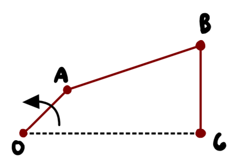

# Purpose
This package was created to aid with the designing process of mechanisms involving linkages, cams, and gears. In regard 
to linkages, it is capable of implementing a kinematic analysis with the knowledge of the degrees of freedom for the 
vectors that make up the mechanism. With the aid of numerical solving and iteration, the position, velocity, and 
acceleration of these vectors and points may be acquired. 

In regard to cams, this package is capable of supplying coordinates of a cam profile, plotting SVAJ diagrams, and 
getting a cam and follower animation for roller and flat faced followers. In turn, the coordinates may be supplied to a 
machinist or imported into SolidWorks. All that is needed to know is the motion description (i.e. 
rise 2 inches in 1 second, dwell for 1.5 seconds, fall 2 inches in 3 seconds). As of right now, the kinds of motion 
supported are naive/uniform motion (how the cam shouldn't be designed), harmonic motion, and cycloidal motion. It is 
possible that this gets updated in the future with better options such as modified sinusoidal motion. 

Gears are not yet supported for this package. The goal in the future is to be able to design a custom gear by knowing 
properties of an involute gear tooth. Similarly to the cam profile, the coordinates could be extracted. 

# Linkages, Cranks, Couplers, and Rockers
In order to use the contents of `mechanism.py`, a basic knowledge of vector loops must be known. The structure of the 
vector loops function is shown in several files under the `examples` folder. To gain a greater understanding of this 
package's usage, this walk through is provided. 

## Four Bar Linkage Example

A four bar linkage is the basic building block of all mechanisms. This is similar to how the triangle is the basic 
building block of all structures. What defines a mechanism or structure is the system's overall number of degrees of 
freedom, and the number of degrees of freedom is determined via Kutzbach’s equation. 
