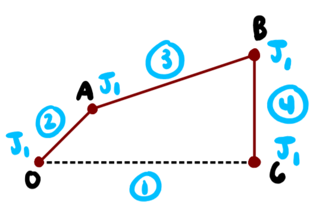
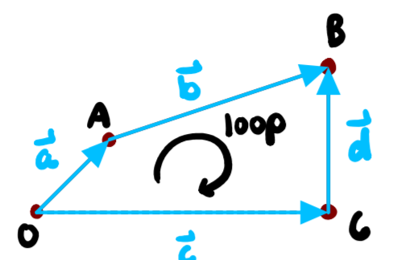
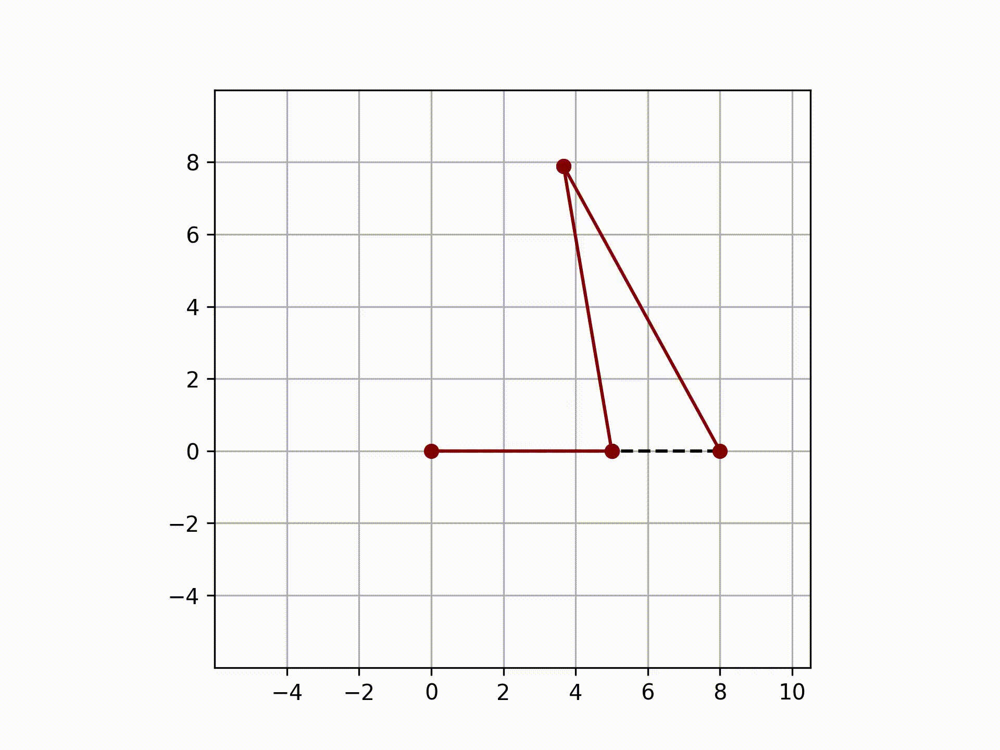
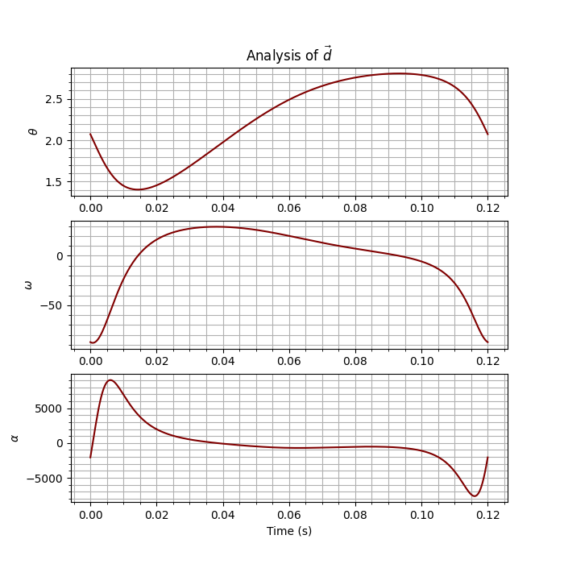

# Purpose
This package was created to aid with the designing process of mechanisms involving linkages, cams, and gears. In regard 
to linkages, it is capable of implementing a kinematic analysis with the knowledge of the degrees of freedom for the 
vectors that make up the mechanism. With the aid of numerical solving and iteration, the position, velocity, and 
acceleration of these vectors and points may be acquired. 

In regard to cams, this package is capable of supplying coordinates of a cam profile, plotting SVAJ diagrams, and 
getting a cam and follower animation for roller and flat faced followers. In turn, the coordinates may be supplied to a 
machinist or imported into SolidWorks. All that is needed to know is the motion description (i.e. 
rise 2 inches in 1 second, dwell for 1.5 seconds, fall 2 inches in 3 seconds). As of right now, the kinds of motion 
supported are naive/uniform motion (how the cam shouldn't be designed), harmonic motion, and cycloidal motion. It is 
possible that this gets updated in the future with better options such as modified sinusoidal motion. 

Gears are not yet supported for this package. The goal in the future is to be able to design a custom gear by knowing 
properties of an involute gear tooth. Similarly to the cam profile, the coordinates could be extracted. 

# Linkages, Cranks, Couplers, and Rockers
In order to use the contents of `mechanism.py`, a basic knowledge of vector loops must be known. The structure of the 
vector loops function is shown in several files under the `examples` folder. To gain a greater understanding of this 
package's usage, this walk through is provided. 

## Four Bar Linkage Example


A four bar linkage is the basic building block of all mechanisms. This is similar to how the triangle is the basic 
building block of all structures. What defines a mechanism or structure is the system's overall number of degrees of 
freedom, and the number of degrees of freedom is determined via Kutzbach’s equation.



Kutzbach's equation is: *total degrees of freedom = 3(#links - 1) - 2(J1) - J2* where J1 is the number of full joints 
(also known as a revolute joint) and J2 is the number of half joints. For this four bar linkage, there are 4 full
joints. 

The number of degrees of freedom is: 3(4 - 1) - 2(4) = 1

This means that we need one known input to find the unknowns of the system. This can be explained further with a diagram
of the vectors that make up the four bar linkage. 



From the above image, the vector "a" is the crank. The speed at which it rotates will be considered as the input to the 
system, and thus, it is the defining parameter to the system. 

The lengths of all the vectors are known. The only two unknowns are the angle that corresponds to vector "b" and "d". It
is important to note that the objects that make up this package are vectors, and the polar form of the vectors is the 
main interest. 

There is only one loop equation which provides two equations when breaking down the vectors into its components. With 
two equations and two unknowns, this system becomes solvable. 

### Problem Statement
Consider the four bar linkage shown above. The lengths of a, b, c, and d are 5", 8", 8" and 9". The crank (a) rotates at
a constant 500 RPM. Use `mechanism` to get an animation of this linkage system and plot the angles, angular velocity, 
and angular acceleration of vector d as a function of time. 

### Solution
The four bar linkage is a grashof linkage because it satisfies the grashof condition (9 + 5 < 8 + 8). This means that 
the crank is able to fully rotate. The input can be deduced by integrating and differentiating the constant value of the
constant angular velocity of the crank. 

Always begin with defining the joints and vectors. 

```python
from mechanism import *
import numpy as np
import matplotlib.pyplot as plt

# Declare the joints that make up the system.
O, A, B, C = get_joints('O A B C')

# Declare the vectors and keep in mind that angles are in radians and start from the positive x-axis.
a = Vector((O, A), r=5)
b = Vector((A, B), r=8)
c = Vector((O, C), r=8, theta=0, style='ground')
d = Vector((C, B), r=9)
```

Always define the vectors in the polar form. The first argument are the joints, and the first joint is the tail of the 
vector, and the second is the head. Additionally, extra keyword arguments will be passed to plt.plot() for styling. 
There should be half as many loop equations as there are unknown. The input vector "a" does not need to have its known 
values at its declaration. The next thing to do is to define the known input and guesses for the first iteration of the 
unknown values. 

```python
# Define the known input to the system.
# For a 500 RMP crank, the time it takes to rotate one rev is 0.12s
time = np.linspace(0, 0.12, 300)
angular_velocity = 50*np.pi/3  # This is 500 RPM in rad/s

theta = angular_velocity*time  # Integrate to find the theta
omega = np.full((time.size,), angular_velocity)  # Just an array of the same angular velocity
alpha = np.zeros(time.size)

# Guess the unknowns
pos_guess = np.deg2rad([45, 90])
vel_guess = np.array([1000, 1000])
acc_guess = np.array([1000, 1000])
```

The guess values need to be arrays of the same length as the number of unknowns. These arrays will be passed as the 
first iteration. The next thing to do is to define the loop function and create the mechanism object. 

```python
# Define the loop equation(s)
def loop(x, i):
    return a(i) + b(x[0]) - c() - d(x[1])


# Create the mechanism object
mechanism = Mechanism(vectors=(a, b, c, d), input_vector=a, loops=loop, pos=theta, vel=omega, acc=alpha,
                      guess=(pos_guess, vel_guess, acc_guess))
```

This example is simpler than most others because there is only one loop equation. For multiple loop equations, it is 
important that the function returns a flattened array of the same length as there are unknown, and the return array 
corresponds to the input guess values. The second argument is the input. It is strongly encouraged to view the examples 
for the more rigorous structure of the loop function. The last thing to do is to call `mechanism.iterate()`, which is 
necessary if the input from `pos`, `vel`, and `acc` are arrays. If they are not arrays, then it is assumed that the 
mechanism at an instant is desired. If this is the case, then call `mechanism.calculate()` then call `mechanism.plot()`.

```python
# Call mechanism.iterate() then get and show the animation
mechanism.iterate()
ani = mechanism.get_animation()

# Plot the angles, angular velocity, and angular acceleration of vector d
fig, ax = plt.subplots(nrows=3, ncols=1)
ax[0].plot(time, d.pos.thetas, color='maroon')
ax[1].plot(time, d.vel.omegas, color='maroon')
ax[2].plot(time, d.acc.alphas, color='maroon')

ax[0].set_ylabel(r'$\theta$')
ax[1].set_ylabel(r'$\omega$')
ax[2].set_ylabel(r'$\alpha$')

ax[2].set_xlabel(r'Time (s)')
ax[0].set_title(r'Analysis of $\vec{d}$')

for a in (ax[0], ax[1], ax[2]):
    a.minorticks_on()
    a.grid(which='both')

fig.set_size_inches(7, 7)
# fig.savefig('../images/analysis_d.png')

plt.show()
```

This will produce the following output: 




# Cams
The
